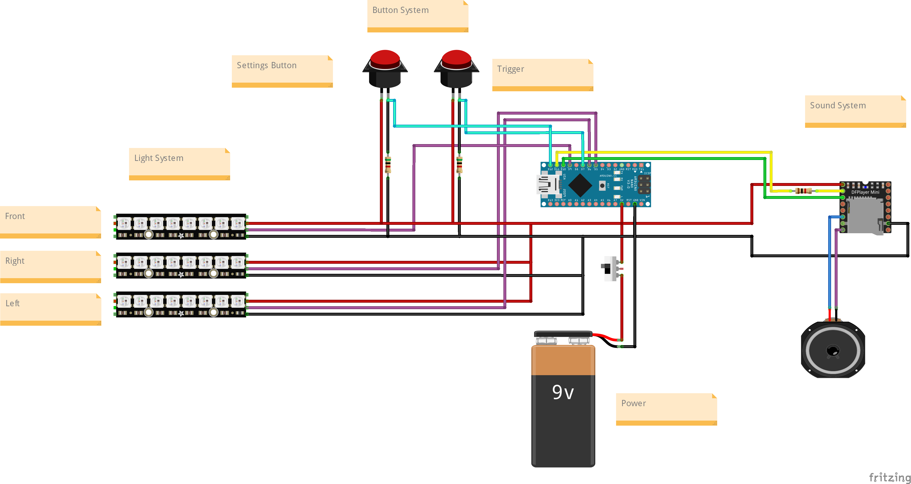

# BlasterReplica
The logic and build process of an Arduino controlled, configurable star wars blaster replica. Capable of playing sounds and lighting up LEDs.

# Functions
- The blaster can shoot by pressing the trigger. This activates a sound and a short LED animation.
- Pressing the sound button changes the sound profile for the trigger.
- Pressing the color button changes the color profile for the trigger.

# Wiring

# Hardware
- [DFPlayer Mini audio driver](https://www.amazon.de/dp/B07Z5D7T63?psc=1&smid=A1X7QLRQH87QA3&ref_=chk_typ_imgToDp)
- [Speaker](https://www.amazon.de/gp/product/B0822XCPT8/ref=ppx_yo_dt_b_asin_title_o00_s04?ie=UTF8&psc=1)
- [Arduino Nano formfactor microcontroller](https://www.amazon.de/gp/product/B078SBBST6/ref=ppx_yo_dt_b_asin_title_o00_s04?ie=UTF8&psc=1)
- [Buttons](https://www.amazon.de/gp/product/B0811QKG1R/ref=ppx_yo_dt_b_asin_title_o01_s04?ie=UTF8&psc=1)
- [Neopixel Single LED](https://www.amazon.de/BTF-LIGHTING-RGB-Legierung-LED-Chips-PCB-K%C3%BChlk%C3%B6rper-Eingebauter/dp/B088K6C7TJ/ref=sr_1_7?__mk_de_DE=%C3%85M%C3%85%C5%BD%C3%95%C3%91&crid=S968MAIDA78Z&keywords=neopixel+led&qid=1696264705&sprefix=neopixel+le%2Caps%2C151&sr=8-7)
- [Neopixel LED Strip](https://www.amazon.de/LED-Streifen-flexibel-Traumfarbstreifen-Wasserdichtes-DIY-Projekt/dp/B08P6XN49P/ref=sr_1_7?crid=31JOL1EBE7NYI&keywords=neopixel+led+strip&qid=1696264865&sprefix=neopixel+%2Caps%2C159&sr=8-7)
- [Powerbank as a battery](https://www.amazon.de/gp/product/B082PMBWRZ/ref=ppx_yo_dt_b_asin_title_o00_s03?ie=UTF8&psc=1)
- [Trigger switch](https://www.amazon.de/gp/product/B08H52SDG2/ref=ppx_yo_dt_b_asin_image_o00_s02?ie=UTF8&psc=1)
- [Power switch](https://www.amazon.de/gp/product/B0BTM3WQXN/ref=ppx_yo_dt_b_asin_title_o00_s00?ie=UTF8&psc=1)
- A small status LED
- Resistors (220, 1k, 5k)

# Model
You can use whatever blaster model you want, especially due to the customizability of the system. I have integrated the system in an unmodified print of the [DC-17 Handblaster](https://www.thingiverse.com/thing:4509310) by Thingiverse user Jetstorm_3D. The model was printed using an Creality Ender 3 Pro with [PLA+ filament](https://www.amazon.de/gp/product/B07R6PL63K/ref=ppx_yo_dt_b_search_asin_title?ie=UTF8&th=1).